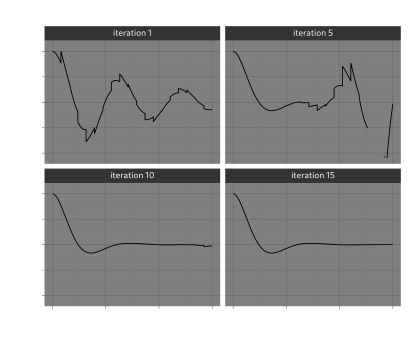
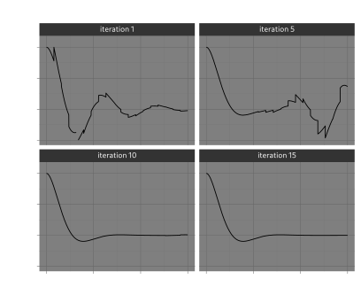
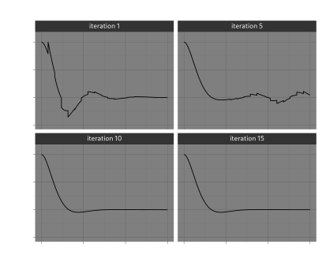

# Tutorial: using HDF5 and MPI and Dask futures
In this example, we look again at the example of a dampened harmonic oscillator. This time we will go in engineering overkill mode and show how a model can be scaled to a large compute cluster using Dask, MPI and HDF5 as intermediate storage. To avoid confusion and difficult software configuration, we won't use the MPI feature of the HDF5 format. Instead, every job will write its output to its own HDF5 file.

This tutorial covers the following concepts:

* delayed arithmetic expressions
* defining the coarse and fine integrators
* using MPI with Dask

## Best practices
The following shows some best practices when working with orchestrated computations. One is about using well established data standards, the other about reducing overhead on the distributed scheduler. We can solve both these issues by abstracting over the representation of the state vector in our system. This technique is definitely overkill for our harmonic oscillator example, but it is also in general a good recipe for running Numpy based simulations in an organized manner.


``` {.python title="examples/mpi_futures.py"}
from __future__ import annotations
import argh  # type: ignore
import numpy as np
from pathlib import Path
from dataclasses import dataclass, field
from typing import (Union, Callable, Optional, Any, Iterator)
import logging

<<example-mpi-imports>>
<<vector-expressions>>
<<example-mpi-coarse>>
<<example-mpi-fine>>
<<example-mpi-history>>

def get_data(files: list[Path]) -> Iterator[np.ndarray]:
    for n in files:
        with h5.File(n, "r") as f:
            yield f["data"][:]

def combine_fine_data(files: list[Path]) -> np.ndarray:
    data = get_data(files)
    first = next(data)
    return np.concatenate([first] + [x[1:] for x in data], axis=0)

def main(log: str = "WARNING", log_file: Optional[str] = None,
         OMEGA0=1.0, ZETA=0.5, H=0.01):
    """Run model of dampened hormonic oscillator in Dask"""
    log_level = getattr(logging, log.upper(), None)
    if not isinstance(log_level, int):
        raise ValueError(f"Invalid log level `{log}`")
    logging.basicConfig(level=log_level, filename=log_file)
    <<example-mpi-main>>

if __name__ == "__main__":
    argh.dispatch_command(main)
```


## Vector Arithmetic Expressions
### Abstract vectors
It may be convenient to treat our `Vector` operations such that they are only performed once their output is needed. That way, we only need to schedule the actual integration steps as external jobs. In the meantime we have to store the arithmetic in a serializable `Expression` value. By doing this we reduce the amount of jobs that have to be handled by the scheduler, but also we reduce the amount of data that is being written and read from the file system.

We will be using `functools.partial` and functions `operator.add`, `operator.mul` etc, to create a data structure that describes all the operations that we might do on a `Vector`. Results may be stored for reference in a `hdf5` file, a feature that can also be hidden behind our `Vector` interface.

``` {.python title="#example-mpi-imports"}
import operator
from functools import partial
import h5py as h5  # type: ignore
from abc import (ABC, abstractmethod)
```

We create a `Vector` class that satisfies the `Vector` concept outlined earlier. We store the operations in terms of unary and binary operators.

``` {.python title="#vector-expressions"}
class Vector(ABC):
    @abstractmethod
    def reduce(self: Vector) -> np.ndarray:
        pass

    def __add__(self, other):
        return BinaryExpr(operator.add, self, other)

    def __sub__(self, other):
        return BinaryExpr(operator.sub, self, other)

    def __mul__(self, scale):
        return UnaryExpr(partial(operator.mul, scale), self)

    def __rmul__(self, scale):
        return UnaryExpr(partial(operator.mul, scale), self)
```

The `Vector` class acts as a base class for the implementation of `BinaryExpr` and `UnaryExpr`, so that we can nest expressions accordingly. To force computation of a `Vector`, we supply the `reduce_expr` function that, in an example of terrible duck-typing, calls the `reduce` method recursively, until an object is reached that doesn't have the `reduce` method.

``` {.python title="#vector-expressions"}
def reduce_expr(expr: Union[np.ndarray, Vector]) -> np.ndarray:
    while isinstance(expr, Vector):
        expr = expr.reduce()
    return expr
```

### HDF5 Vectors
This means we can also hide variables that are stored in an HDF5 file behind this interface. We often want to store more information than just the state vector. In the case of parareal, we have results from fine integration and coarse integration. In the case of fine integration, what we need to represent is the final state of the integration, but we are also interested in the intermediate steps.

``` {.python title="#vector-expressions"}
@dataclass
class H5Snap(Vector):
    path: Path
    loc: str
    slice: list[Union[None, int, slice]]

    def data(self):
        with h5.File(self.path, "r") as f:
            return f[self.loc].__getitem__(tuple(self.slice))

    def reduce(self):
        x = self.data()
        logger = logging.getLogger()
        logger.debug(f"read {x} from {self.path}")
        return self.data()
```

To generate slices in a nice manner we can use a helper class:

``` {.python title="#vector-expressions"}
class Index:
    def __getitem__(self, idx):
        if isinstance(idx, tuple):
            return list(idx)
        else:
            return [idx]

index = Index()
```

Then `index[a:b,c]` returns a list of slices `[slice(a,b), c]` (type `list[Union[None, int, slice]]`).

### Operators
There are two classes of operators, unary and binary (more arguments can usually be expressed as a composition of unary and binary forms). We store the arguments together with a function operating on the arguments. The function should be serializable (e.g. using `pickle`), meaning that `lambda` expressions are not allowed, but `partial` applications and functions in `operator` typically are ok.

``` {.python title="#vector-expressions"}
@dataclass
class UnaryExpr(Vector):
    func: Callable[[np.ndarray], np.ndarray]
    inp: Vector

    def reduce(self):
        a = reduce_expr(self.inp)
        return self.func(a)


@dataclass
class BinaryExpr(Vector):
    func: Callable[[np.ndarray, np.ndarray], np.ndarray]
    inp1: Vector
    inp2: Vector

    def reduce(self):
        a = reduce_expr(self.inp1)
        b = reduce_expr(self.inp2)
        return self.func(a, b)
```

### Literal expressions
To bootstrap our computation we may need to define a `Vector` directly represented by a Numpy array.

``` {.python title="#vector-expressions"}
@dataclass
class LiteralExpr(Vector):
    value: np.ndarray

    def reduce(self):
        return self.value
```

## The coarse and fine solvers
The API of `parareal` expects us to specify a solver with a function of three arguments, `y0`, `t0` and `t1`. For this function, we need the model input parameters to be in scope. Not only that, the scope needs to be completely serialised using `pickle`. For this reason, it is not enough to have a closure. We need to define a dataclass with a single `solution` method.

The `Coarse` solution is not explicitely archived. We let `dask` handle the propagation of the result to further computations.

``` {.python title="#example-mpi-coarse"}
@dataclass
class Coarse:
    n_iter: int
    system: Any

    def solution(self, y, t0, t1):
        a = LiteralExpr(forward_euler(self.system)(reduce_expr(y), t0, t1))
        logging.debug(f"coarse result: {y} {reduce_expr(y)} {t0} {t1} {a}")
        return a
```

For the `fine` integrator however, we want to save the complete result, so that we can retrieve the full history after the computation has finished. So, instead of a `LiteralExpr`, the fine integrator returns a `H5Snap`.

``` {.python title="#example-mpi-fine"}
def generate_filename(name: str, n_iter: int, t0: float, t1: float) -> str:
    return f"{name}-{n_iter:04}-{int(t0*1000):06}-{int(t1*1000):06}.h5"

@dataclass
class Fine:
    parent: Path
    name: str
    n_iter: int
    system: Any
    h: float

    def solution(self, y, t0, t1):
        logger = logging.getLogger()
        n = math.ceil((t1 - t0) / self.h)
        t = np.linspace(t0, t1, n + 1)

        self.parent.mkdir(parents=True, exist_ok=True)
        path = self.parent / generate_filename(self.name, self.n_iter, t0, t1)

        with h5.File(path, "w") as f:
            logger.debug("fine %f - %f", t0, t1)
            y0 = reduce_expr(y)
            logger.debug(":    %s -> %s", y, y0)
            x = tabulate(forward_euler(self.system), reduce_expr(y), t)
            ds = f.create_dataset("data", data=x)
            ds.attrs["t0"] = t0
            ds.attrs["t1"] = t1
            ds.attrs["h"] = self.h
            ds.attrs["n"] = n
        return H5Snap(path, "data", index[-1])
```

## Keeping track of convergence
We want to cancel any scheduled computations as soon has we are happy that parareal has converged. This means we need to keep track of the results coming in, and check for convergence. This is done in the `History` class.

``` {.python title="#example-mpi-history"}
@dataclass
class History:
    archive: Path
    history: list[list[Vector]] = field(default_factory=list)

    def convergence_test(self, y) -> bool:
        logger = logging.getLogger()
        self.history.append(y)
        if len(self.history) < 2:
            return False
        a = np.array([reduce_expr(x) for x in self.history[-2]])
        b = np.array([reduce_expr(x) for x in self.history[-1]])
        maxdif = np.abs(a - b).max()
        converged = maxdif < 1e-4
        logger.info("maxdif of %f", maxdif)
        if converged:
            logger.info("Converged after %u iteration", len(self.history))
        return converged
```

### Dask with MPI
There are two modes in which we may run Dask with MPI. One with a `dask-mpi` running as external scheduler, the other running everything as a single script. For this example we opt for the second, straight from the dask-mpi documentation:

``` {.python title="#example-mpi-imports"}
import dask
# from dask_mpi import initialize  # type: ignore
from dask.distributed import Client  # type: ignore
```

``` {.python title="#example-mpi-main"}
# initialize()
client = Client(n_workers=4, threads_per_worker=1)
```

## Running the harmonic oscillator

``` {.python title="#example-mpi-imports"}
from parareal.futures import (Parareal)

from parareal.forward_euler import forward_euler
from parareal.tabulate_solution import tabulate
from parareal.harmonic_oscillator import (underdamped_solution, harmonic_oscillator)

import math
```

For reference, we also run the full integrator using just the `Fine` solution.

``` {.python title="#example-mpi-main"}
system = harmonic_oscillator(OMEGA0, ZETA)
y0 = np.array([1.0, 0.0])
t = np.linspace(0.0, 15.0, 20)
archive = Path("./output/euler")
tabulate(Fine(archive, "fine", 0, system, H).solution, LiteralExpr(y0), t)
```


### Running parareal

``` {.python title="#example-mpi-main"}
archive = Path("./output/parareal")
p = Parareal(
    client,
    lambda n: Coarse(n, system).solution,
    lambda n: Fine(archive, "fine", n, system, H).solution)
jobs = p.schedule(LiteralExpr(y0), t)
history = History(archive)
p.wait(jobs, history.convergence_test)

client.close()
```

## Convergence
The nice thing about the example with a dampened oscillator, is that we have a parameter by which we can tweak the amount of oscillations. Parareal is notoriously bad at oscillating behaviour, so we should see that reflected in the amount of iterations needed to converge.





